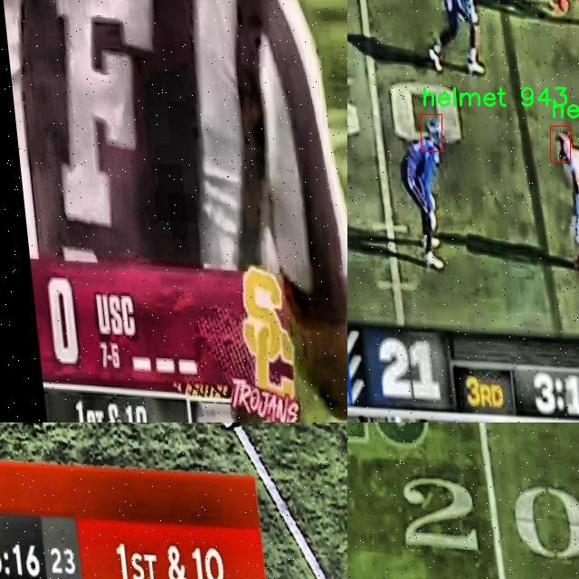

# 运动安全头盔检测检测系统源码分享
 # [一条龙教学YOLOV8标注好的数据集一键训练_70+全套改进创新点发刊_Web前端展示]

### 1.研究背景与意义

项目参考[AAAI Association for the Advancement of Artificial Intelligence](https://gitee.com/qunmasj/projects)

项目来源[AACV Association for the Advancement of Computer Vision](https://kdocs.cn/l/cszuIiCKVNis)

研究背景与意义

随着体育活动的普及和竞技水平的提高，运动安全问题日益受到重视。尤其是在极限运动、团队运动等高风险项目中，运动员的头部保护显得尤为重要。头盔作为保护运动员头部的重要装备，其佩戴情况直接关系到运动员的安全。因此，开发一种高效、准确的运动安全头盔检测系统，不仅能够提高运动员的安全性，还能为运动管理和监控提供重要的数据支持。

近年来，计算机视觉技术的迅猛发展为运动安全监测提供了新的解决方案。YOLO（You Only Look Once）系列目标检测算法因其高效性和实时性而受到广泛关注。YOLOv8作为该系列的最新版本，结合了深度学习的最新进展，具备了更强的特征提取能力和更快的推理速度。通过对YOLOv8进行改进，可以进一步提升其在特定场景下的检测性能，尤其是在复杂背景和多种运动状态下的头盔检测。

本研究所使用的数据集“SportsLocationTracking_Helmets”包含1500张运动头盔的图像，涵盖了多种运动场景和环境。这一数据集的构建为训练和验证运动安全头盔检测系统提供了坚实的基础。数据集中仅包含一个类别——头盔，确保了模型在特定任务上的专注性和准确性。通过对该数据集的深入分析和处理，可以有效提升模型在实际应用中的鲁棒性和适应性。

在运动安全领域，实时监测和自动识别运动员佩戴头盔的情况，对于预防意外伤害具有重要意义。通过改进YOLOv8的运动安全头盔检测系统，能够实现对运动员头盔佩戴情况的实时监控，及时发现未佩戴或佩戴不当的情况，从而为教练员和管理者提供科学依据，制定相应的安全措施。此外，该系统还可以为运动员提供反馈，提升其安全意识，促进安全文化的建设。

综上所述，基于改进YOLOv8的运动安全头盔检测系统的研究，不仅具有重要的理论价值，还具备广泛的实际应用前景。通过该系统的实施，可以有效提升运动员的安全保障水平，降低运动伤害的发生率，为推动体育事业的健康发展贡献力量。同时，该研究也为计算机视觉技术在运动安全领域的应用提供了新的思路和方法，推动了相关技术的进步与创新。

### 2.图片演示


##### 注意：由于此博客编辑较早，上面“2.图片演示”和“3.视频演示”展示的系统图片或者视频可能为老版本，新版本在老版本的基础上升级如下：（实际效果以升级的新版本为准）

  （1）适配了YOLOV8的“目标检测”模型和“实例分割”模型，通过加载相应的权重（.pt）文件即可自适应加载模型。

  （2）支持“图片识别”、“视频识别”、“摄像头实时识别”三种识别模式。

  （3）支持“图片识别”、“视频识别”、“摄像头实时识别”三种识别结果保存导出，解决手动导出（容易卡顿出现爆内存）存在的问题，识别完自动保存结果并导出到tempDir中。

  （4）支持Web前端系统中的标题、背景图等自定义修改，后面提供修改教程。

  另外本项目提供训练的数据集和训练教程,暂不提供权重文件（best.pt）,需要您按照教程进行训练后实现图片演示和Web前端界面演示的效果。

### 3.视频演示

[3.1 视频演示](https://www.bilibili.com/video/BV1c5szePEgK/)

### 4.数据集信息展示

##### 4.1 本项目数据集详细数据（类别数＆类别名）

nc: 1
names: ['helmet']


##### 4.2 本项目数据集信息介绍

数据集信息展示

在现代运动安全管理中，头盔的有效检测与识别至关重要。为此，本研究选用了名为“SportsLocationTracking_Helmets”的数据集，以改进YOLOv8模型在运动安全头盔检测系统中的应用。该数据集专注于运动场景中的头盔识别，旨在为运动员的安全提供更为精准的技术支持。

“SportsLocationTracking_Helmets”数据集的设计充分考虑了运动环境的复杂性和多样性。数据集中包含的类别数量为1，专注于“helmet”这一单一类别。这一设计不仅简化了模型的训练过程，还确保了在特定场景下的高效识别能力。尽管类别数量有限，但该数据集通过丰富的样本和多样的拍摄角度，涵盖了不同类型和样式的运动头盔，确保了模型在实际应用中的广泛适应性。

数据集中的图像样本来自多种运动场景，包括但不限于足球、篮球、滑雪等。这些场景不仅反映了不同运动项目对头盔的需求，还展示了运动员在不同环境下的动态表现。每张图像都经过精心标注，确保模型在训练过程中能够准确学习到头盔的特征。这种高质量的标注为后续的模型优化提供了坚实的基础。

此外，数据集的构建还考虑到了光照、天气和运动员动作等多种因素的影响。通过在不同的时间和环境条件下拍摄，数据集中的图像展现了丰富的多样性。这种多样性使得模型在训练时能够更好地应对现实世界中可能遇到的各种挑战，从而提高了运动安全头盔检测系统的鲁棒性和准确性。

在数据集的使用过程中，研究者们可以利用YOLOv8的先进特性，结合“SportsLocationTracking_Helmets”数据集进行深度学习训练。YOLOv8作为一种高效的目标检测模型，能够在保持高精度的同时实现实时检测，这对于运动安全领域尤为重要。通过对该数据集的训练，模型将能够在实际应用中快速、准确地识别运动员佩戴的头盔，从而为运动安全提供及时的预警和保障。

综上所述，“SportsLocationTracking_Helmets”数据集不仅为改进YOLOv8模型提供了丰富的训练素材，还为运动安全头盔的检测系统奠定了坚实的基础。通过对该数据集的深入研究与应用，未来的运动安全管理将更加智能化和高效化，为运动员的安全保驾护航。





### 5.全套项目环境部署视频教程（零基础手把手教学）

[5.1 环境部署教程链接（零基础手把手教学）](https://www.ixigua.com/7404473917358506534?logTag=c807d0cbc21c0ef59de5)


[5.2 安装Python虚拟环境创建和依赖库安装视频教程链接（零基础手把手教学）](https://www.ixigua.com/7404474678003106304?logTag=1f1041108cd1f708b01a)

### 6.手把手YOLOV8训练视频教程（零基础小白有手就能学会）

[6.1 手把手YOLOV8训练视频教程（零基础小白有手就能学会）](https://www.ixigua.com/7404477157818401292?logTag=d31a2dfd1983c9668658)

### 7.70+种全套YOLOV8创新点代码加载调参视频教程（一键加载写好的改进模型的配置文件）

[7.1 70+种全套YOLOV8创新点代码加载调参视频教程（一键加载写好的改进模型的配置文件）](https://www.ixigua.com/7404478314661806627?logTag=29066f8288e3f4eea3a4)

### 8.70+种全套YOLOV8创新点原理讲解（非科班也可以轻松写刊发刊，V10版本正在科研待更新）

由于篇幅限制，每个创新点的具体原理讲解就不一一展开，具体见下列网址中的创新点对应子项目的技术原理博客网址【Blog】：


[8.1 70+种全套YOLOV8创新点原理讲解链接](https://gitee.com/qunmasj/good)

### 9.系统功能展示（检测对象为举例，实际内容以本项目数据集为准）

图9.1.系统支持检测结果表格显示

  图9.2.系统支持置信度和IOU阈值手动调节

  图9.3.系统支持自定义加载权重文件best.pt(需要你通过步骤5中训练获得)

  图9.4.系统支持摄像头实时识别

  图9.5.系统支持图片识别

  图9.6.系统支持视频识别

  图9.7.系统支持识别结果文件自动保存

  图9.8.系统支持Excel导出检测结果数据


### 10.原始YOLOV8算法原理

原始YOLOv8算法原理

YOLOv8作为2023年1月由Ultralytics发布的最新目标检测模型，标志着YOLO系列算法的又一次重大进化。它不仅继承了前几代模型的优点，还在多个关键技术上进行了创新，旨在提升目标检测的精度和速度，满足现代应用对实时性和准确性的双重需求。YOLOv8的设计理念是集成多种先进的技术，通过优化网络结构和算法流程，形成一个高效的检测系统，适用于各种复杂的视觉识别任务。

YOLOv8的网络结构主要由四个部分组成：输入模块、Backbone骨干网络、Neck特征融合网络和Head检测模块。输入模块负责对输入图像进行预处理，包括图像的缩放、增强和特征点计算等。这一过程确保了模型能够处理不同尺寸和格式的图像，从而提高了模型的适应性和鲁棒性。YOLOv8采用了Mosaic增强技术，这种技术通过将多张图像拼接在一起，生成新的训练样本，能够有效提升模型的泛化能力。

在Backbone部分，YOLOv8采用了CSPDarknet结构，显著提升了特征提取的效率。CSPDarknet通过将输入特征图分为两个分支，每个分支都经过卷积层进行降维处理，从而形成更高维度的特征图。这种设计不仅提高了特征提取的深度，还有效减少了计算量。与前代模型相比，YOLOv8使用了C2f模块替代了C3模块，C2f模块的设计理念是通过引入更多的分支来增强梯度流动信息，使得特征图的表达能力更强。每个v8_C2fBottleneck层的输出也被用作分支，这种多分支结构的堆叠使得特征图在信息传递过程中更加丰富。

Neck部分则采用了特征金字塔网络（FPN）和路径聚合网络（PAN）的结合，这一结构能够有效促进语义特征和定位特征的融合。通过多层卷积和池化操作，Neck部分将来自Backbone的特征图进行压缩和处理，从而生成多尺度的特征图。这种特征融合机制使得YOLOv8在面对不同尺寸和形状的目标时，能够保持高效的检测性能，确保模型在各种场景下的适用性。

在Head检测模块中，YOLOv8采用了解耦头的结构，将回归分支和预测分支进行分离。这一设计不仅加速了模型的收敛速度，还提高了检测的准确性。YOLOv8的检测方式是基于无锚框（Anchor-Free）的策略，直接预测目标的中心点和宽高比例，这一创新显著减少了Anchor框的数量，进而提高了检测速度和准确度。无锚框的设计使得模型在处理复杂场景时，能够更灵活地适应目标的变化，避免了传统锚框方法中存在的局限性。

YOLOv8在Loss函数的设计上也进行了优化，借鉴了PP-YOLOE的设计理念，进一步提升了模型的训练效率和检测性能。通过改进的Loss函数，YOLOv8能够更好地平衡目标检测中的定位损失和分类损失，使得模型在训练过程中能够更快地收敛到最优解。这种改进不仅提升了模型的精度，还使得YOLOv8在实际应用中表现出色，能够满足高精度实时检测的需求。

总的来说，YOLOv8通过对网络结构的深度优化和算法流程的创新，达到了目标检测领域的新高度。其高效的特征提取能力、灵活的检测方式以及优化的Loss函数，使得YOLOv8在各种复杂场景下都能保持高精度和高速度的检测性能。随着YOLOv8的发布，目标检测技术在实时性和准确性方面的挑战得到了有效的应对，为未来的智能视觉应用提供了强有力的支持。

在实际应用中，YOLOv8的优势得到了充分体现，尤其是在苹果采摘等农业自动化领域。利用YOLOv8的视觉识别能力，自动采摘机器人能够快速、准确地检测和定位苹果，极大地提高了采摘效率。同时，结合蚁群算法进行路径规划，进一步优化了机器人在果园中的移动路线，确保了采摘过程的高效性和智能化。这一系列技术的结合，不仅推动了农业生产的现代化，也为其他领域的智能化应用提供了宝贵的经验和参考。YOLOv8的发布，标志着目标检测技术的又一次飞跃，预示着未来在智能视觉领域将迎来更多的创新与发展。


### 11.项目核心源码讲解（再也不用担心看不懂代码逻辑）

#### 11.1 code\ultralytics\models\utils\loss.py

以下是对给定代码的核心部分进行分析和详细注释的结果。我们将保留最重要的功能和结构，并提供中文注释以便于理解。

```python
import torch
import torch.nn as nn
import torch.nn.functional as F
from ultralytics.utils.loss import FocalLoss, VarifocalLoss
from ultralytics.utils.metrics import bbox_iou
from .ops import HungarianMatcher

class DETRLoss(nn.Module):
    """
    DETR (DEtection TRansformer) 损失类。该类计算并返回DETR目标检测模型的不同损失组件。
    计算分类损失、边界框损失、GIoU损失，以及可选的辅助损失。
    """

    def __init__(self, nc=80, loss_gain=None, aux_loss=True, use_fl=True, use_vfl=False):
        """
        初始化DETR损失函数。

        参数:
            nc (int): 类别数量。
            loss_gain (dict): 各损失组件的系数。
            aux_loss (bool): 是否计算辅助损失。
            use_fl (bool): 是否使用FocalLoss。
            use_vfl (bool): 是否使用VarifocalLoss。
        """
        super().__init__()

        # 默认损失增益系数
        if loss_gain is None:
            loss_gain = {"class": 1, "bbox": 5, "giou": 2}
        self.nc = nc  # 类别数量
        self.matcher = HungarianMatcher(cost_gain={"class": 2, "bbox": 5, "giou": 2})  # 匹配器
        self.loss_gain = loss_gain  # 损失增益系数
        self.aux_loss = aux_loss  # 是否计算辅助损失
        self.fl = FocalLoss() if use_fl else None  # Focal Loss对象
        self.vfl = VarifocalLoss() if use_vfl else None  # Varifocal Loss对象
        self.device = None  # 设备信息

    def _get_loss_class(self, pred_scores, targets, gt_scores, num_gts):
        """计算分类损失。"""
        bs, nq = pred_scores.shape[:2]  # 获取批次大小和查询数量
        one_hot = torch.zeros((bs, nq, self.nc + 1), dtype=torch.int64, device=targets.device)
        one_hot.scatter_(2, targets.unsqueeze(-1), 1)  # 创建one-hot编码
        one_hot = one_hot[..., :-1]  # 去掉最后一类（背景类）
        gt_scores = gt_scores.view(bs, nq, 1) * one_hot  # 计算真实得分

        # 使用Focal Loss或Varifocal Loss计算损失
        if self.fl:
            if num_gts and self.vfl:
                loss_cls = self.vfl(pred_scores, gt_scores, one_hot)
            else:
                loss_cls = self.fl(pred_scores, one_hot.float())
            loss_cls /= max(num_gts, 1) / nq  # 归一化损失
        else:
            loss_cls = nn.BCEWithLogitsLoss(reduction="none")(pred_scores, gt_scores).mean(1).sum()  # 二元交叉熵损失

        return {"loss_class": loss_cls.squeeze() * self.loss_gain["class"]}  # 返回分类损失

    def _get_loss_bbox(self, pred_bboxes, gt_bboxes):
        """计算边界框损失和GIoU损失。"""
        loss = {}
        if len(gt_bboxes) == 0:  # 如果没有真实边界框
            loss["loss_bbox"] = torch.tensor(0.0, device=self.device)
            loss["loss_giou"] = torch.tensor(0.0, device=self.device)
            return loss

        # 计算L1损失
        loss["loss_bbox"] = self.loss_gain["bbox"] * F.l1_loss(pred_bboxes, gt_bboxes, reduction="sum") / len(gt_bboxes)
        # 计算GIoU损失
        loss["loss_giou"] = 1.0 - bbox_iou(pred_bboxes, gt_bboxes, xywh=True, GIoU=True)
        loss["loss_giou"] = loss["loss_giou"].sum() / len(gt_bboxes)
        loss["loss_giou"] = self.loss_gain["giou"] * loss["loss_giou"]
        return {k: v.squeeze() for k, v in loss.items()}  # 返回损失字典

    def _get_loss(self, pred_bboxes, pred_scores, gt_bboxes, gt_cls):
        """计算所有损失。"""
        match_indices = self.matcher(pred_bboxes, pred_scores, gt_bboxes, gt_cls)  # 获取匹配索引
        idx, gt_idx = self._get_index(match_indices)  # 获取索引
        pred_bboxes, gt_bboxes = pred_bboxes[idx], gt_bboxes[gt_idx]  # 获取匹配的边界框

        bs, nq = pred_scores.shape[:2]
        targets = torch.full((bs, nq), self.nc, device=pred_scores.device, dtype=gt_cls.dtype)  # 初始化目标
        targets[idx] = gt_cls[gt_idx]  # 设置目标类别

        gt_scores = torch.zeros([bs, nq], device=pred_scores.device)  # 初始化真实得分
        if len(gt_bboxes):
            gt_scores[idx] = bbox_iou(pred_bboxes.detach(), gt_bboxes, xywh=True).squeeze(-1)  # 计算真实得分

        loss = {}
        loss.update(self._get_loss_class(pred_scores, targets, gt_scores, len(gt_bboxes)))  # 更新分类损失
        loss.update(self._get_loss_bbox(pred_bboxes, gt_bboxes))  # 更新边界框损失
        return loss  # 返回所有损失

    def forward(self, pred_bboxes, pred_scores, batch):
        """
        前向传播，计算损失。

        参数:
            pred_bboxes (torch.Tensor): 预测的边界框。
            pred_scores (torch.Tensor): 预测的得分。
            batch (dict): 包含真实标签的字典。

        返回:
            (dict): 包含总损失的字典。
        """
        self.device = pred_bboxes.device  # 设置设备
        gt_cls, gt_bboxes = batch["cls"], batch["bboxes"]  # 获取真实类别和边界框

        total_loss = self._get_loss(pred_bboxes[-1], pred_scores[-1], gt_bboxes, gt_cls)  # 计算总损失
        return total_loss  # 返回总损失
```

### 代码核心部分说明：
1. **DETRLoss类**：该类是DETR模型的损失计算模块，主要负责计算分类损失、边界框损失和GIoU损失。
2. **初始化方法**：设置损失增益系数、匹配器、Focal Loss和Varifocal Loss等参数。
3. **损失计算方法**：
   - `_get_loss_class`：计算分类损失。
   - `_get_loss_bbox`：计算边界框损失和GIoU损失。
   - `_get_loss`：综合计算所有损失。
4. **前向传播方法**：接收预测的边界框和得分，以及真实标签，返回计算得到的总损失。

通过这些核心部分的注释，能够更好地理解DETR模型中损失计算的流程和逻辑。

该文件实现了一个用于目标检测的损失计算类，主要是为DETR（DEtection TRansformer）模型设计的。文件中定义了两个类：`DETRLoss`和`RTDETRDetectionLoss`，前者是基础损失类，后者是扩展的实时检测损失类。

`DETRLoss`类负责计算DETR模型的各种损失，包括分类损失、边界框损失和广义IoU（GIoU）损失。该类的构造函数接收多个参数，如类别数量、损失增益系数、是否使用辅助损失、是否使用Focal Loss或Varifocal Loss等。损失增益系数用于调整不同损失的权重，确保模型在训练时关注不同类型的错误。

在`DETRLoss`类中，`_get_loss_class`方法计算分类损失。它通过将目标标签转换为one-hot编码形式，并使用Focal Loss或BCEWithLogitsLoss来计算损失。`_get_loss_bbox`方法则计算边界框损失和GIoU损失，使用L1损失和IoU计算方法来评估预测边界框与真实边界框之间的差异。

`_get_loss_aux`方法用于计算辅助损失，主要在多层解码器中使用。该方法会根据给定的匹配索引计算每一层的损失，并将其汇总。`_get_loss`方法则是一个综合方法，负责调用分类损失和边界框损失的计算，并处理匹配索引。

`forward`方法是该类的主要接口，接收预测的边界框和分数，以及真实的标签数据，最终返回计算得到的总损失。

`RTDETRDetectionLoss`类继承自`DETRLoss`，增加了对去噪训练损失的支持。它的`forward`方法除了计算标准的检测损失外，还可以根据提供的去噪元数据计算去噪损失。该类的设计使得在处理去噪任务时，可以方便地集成额外的损失计算。

总的来说，这个文件的核心功能是为DETR模型提供一个灵活且可扩展的损失计算框架，支持多种损失类型和辅助损失的计算，适用于复杂的目标检测任务。

#### 11.2 70+种YOLOv8算法改进源码大全和调试加载训练教程（非必要）\ultralytics\models\fastsam\prompt.py

以下是代码中最核心的部分，并附上详细的中文注释：

```python
import os
import numpy as np
import torch
from PIL import Image
import cv2
from ultralytics.utils import TQDM

class FastSAMPrompt:
    """
    Fast Segment Anything Model 类，用于图像标注和可视化。

    属性:
        device (str): 计算设备（'cuda' 或 'cpu'）。
        results: 目标检测或分割结果。
        source: 源图像或图像路径。
        clip: 用于线性分配的 CLIP 模型。
    """

    def __init__(self, source, results, device='cuda') -> None:
        """初始化 FastSAMPrompt，设置源图像、结果和设备，并导入 CLIP 模型。"""
        self.device = device
        self.results = results
        self.source = source

        # 导入并赋值 CLIP 模型
        try:
            import clip  # 用于线性分配
        except ImportError:
            from ultralytics.utils.checks import check_requirements
            check_requirements('git+https://github.com/openai/CLIP.git')
            import clip
        self.clip = clip

    @staticmethod
    def _format_results(result, filter=0):
        """将检测结果格式化为包含 ID、分割、边界框、分数和面积的注释列表。"""
        annotations = []
        n = len(result.masks.data) if result.masks is not None else 0
        for i in range(n):
            mask = result.masks.data[i] == 1.0
            if torch.sum(mask) >= filter:
                annotation = {
                    'id': i,
                    'segmentation': mask.cpu().numpy(),
                    'bbox': result.boxes.data[i],
                    'score': result.boxes.conf[i]}
                annotation['area'] = annotation['segmentation'].sum()
                annotations.append(annotation)
        return annotations

    @staticmethod
    def _get_bbox_from_mask(mask):
        """从分割掩码中获取边界框。"""
        mask = mask.astype(np.uint8)
        contours, _ = cv2.findContours(mask, cv2.RETR_EXTERNAL, cv2.CHAIN_APPROX_SIMPLE)
        x1, y1, w, h = cv2.boundingRect(contours[0])
        x2, y2 = x1 + w, y1 + h
        if len(contours) > 1:
            for b in contours:
                x_t, y_t, w_t, h_t = cv2.boundingRect(b)
                x1 = min(x1, x_t)
                y1 = min(y1, y_t)
                x2 = max(x2, x_t + w_t)
                y2 = max(y2, y_t + h_t)
        return [x1, y1, x2, y2]

    def plot(self, annotations, output):
        """
        在图像上绘制注释、边界框，并保存输出。

        参数:
            annotations (list): 要绘制的注释。
            output (str): 保存绘图的输出目录。
        """
        pbar = TQDM(annotations, total=len(annotations))
        for ann in pbar:
            result_name = os.path.basename(ann.path)
            image = ann.orig_img[..., ::-1]  # BGR 转 RGB
            plt.figure(figsize=(image.shape[1] / 100, image.shape[0] / 100))
            plt.imshow(image)

            if ann.masks is not None:
                masks = ann.masks.data
                # 绘制掩码
                self.fast_show_mask(masks, plt.gca())

            # 保存图像
            save_path = os.path.join(output, result_name)
            plt.axis('off')
            plt.savefig(save_path, bbox_inches='tight', pad_inches=0, transparent=True)
            plt.close()
            pbar.set_description(f'Saving {result_name} to {save_path}')

    @staticmethod
    def fast_show_mask(annotation, ax):
        """
        快速在给定的 matplotlib 轴上显示掩码注释。

        参数:
            annotation (array-like): 掩码注释。
            ax (matplotlib.axes.Axes): matplotlib 轴。
        """
        n, h, w = annotation.shape  # 批量、高度、宽度
        areas = np.sum(annotation, axis=(1, 2))
        annotation = annotation[np.argsort(areas)]  # 按面积排序

        # 创建显示图像
        show = np.zeros((h, w, 4))
        for i in range(n):
            mask = annotation[i]
            show[mask > 0] = [0, 0, 1, 0.5]  # 蓝色掩码，透明度0.5

        ax.imshow(show)

    @torch.no_grad()
    def retrieve(self, model, preprocess, elements, search_text: str) -> int:
        """处理图像和文本，计算相似度并返回 softmax 分数。"""
        preprocessed_images = [preprocess(image).to(self.device) for image in elements]
        tokenized_text = self.clip.tokenize([search_text]).to(self.device)
        stacked_images = torch.stack(preprocessed_images)
        image_features = model.encode_image(stacked_images)
        text_features = model.encode_text(tokenized_text)
        image_features /= image_features.norm(dim=-1, keepdim=True)
        text_features /= text_features.norm(dim=-1, keepdim=True)
        probs = 100.0 * image_features @ text_features.T
        return probs[:, 0].softmax(dim=0)

    def everything_prompt(self):
        """返回类中处理的结果。"""
        return self.results
```

### 代码核心部分解释：
1. **类的定义**：`FastSAMPrompt` 类用于图像分割和标注，包含了模型的初始化、结果格式化、边界框提取、绘图和结果检索等功能。
2. **初始化方法**：构造函数中设置设备、结果和源图像，并导入 CLIP 模型。
3. **结果格式化**：`_format_results` 方法将模型的输出结果格式化为包含分割掩码、边界框和分数的注释列表。
4. **边界框提取**：`_get_bbox_from_mask` 方法从分割掩码中提取出边界框的坐标。
5. **绘图方法**：`plot` 方法用于在图像上绘制分割结果，并保存为文件。
6. **掩码显示**：`fast_show_mask` 方法快速在 matplotlib 轴上显示掩码注释。
7. **检索方法**：`retrieve` 方法用于处理图像和文本，计算它们之间的相似度。
8. **返回结果**：`everything_prompt` 方法返回处理后的结果。

这个程序文件是一个用于图像注释和可视化的类，名为 `FastSAMPrompt`，它是 Ultralytics YOLO 项目的一部分。该类的主要功能是处理图像分割和目标检测的结果，并通过各种方法进行可视化和交互。

在类的初始化方法中，`__init__`，我们可以看到它接受源图像、检测结果和计算设备（如 CUDA 或 CPU）作为参数。它还尝试导入 CLIP 模型，这是一种用于图像和文本之间相似性计算的模型，如果没有找到，则会通过检查依赖项来确保其可用。

类中定义了一些静态方法和实例方法。`_segment_image` 方法根据给定的边界框坐标对图像进行分割，返回一个包含分割结果的图像。`_format_results` 方法将检测结果格式化为包含 ID、分割、边界框、得分和面积的注释列表。`_get_bbox_from_mask` 方法则通过对掩膜应用形态学变换来获取边界框。

`plot` 方法是该类的核心功能之一，它负责在图像上绘制注释、边界框和点，并将结果保存到指定的输出目录。它使用 Matplotlib 进行可视化，并支持多种选项，如使用随机颜色绘制掩膜、提高掩膜质量等。

`fast_show_mask` 方法用于快速显示掩膜注释，允许用户在给定的 Matplotlib 轴上显示掩膜，并支持绘制边界框和点。`retrieve` 方法则处理图像和文本，通过 CLIP 模型计算相似性并返回软最大值分数。

类中还有一些方法用于处理图像裁剪、边界框和点的提示。`_crop_image` 方法根据提供的注释格式裁剪图像并返回裁剪后的图像和相关数据。`box_prompt` 方法用于修改边界框属性并计算掩膜与边界框之间的交并比（IoU）。`point_prompt` 方法根据用户输入调整检测到的掩膜上的点，并返回修改后的结果。`text_prompt` 方法处理文本提示，将其应用于现有结果并返回更新后的结果。

最后，`everything_prompt` 方法返回类中处理过的结果。这些功能使得 `FastSAMPrompt` 类在图像分割和注释的任务中非常灵活和强大，能够满足用户在不同场景下的需求。

#### 11.3 70+种YOLOv8算法改进源码大全和调试加载训练教程（非必要）\ultralytics\hub\utils.py

以下是经过简化和注释的核心代码部分：

```python
import os
import random
import sys
import threading
import time
from pathlib import Path
import requests
from ultralytics.utils import (ENVIRONMENT, LOGGER, SETTINGS, __version__, colorstr)

# 定义常量
PREFIX = colorstr('Ultralytics HUB: ')
HUB_API_ROOT = os.environ.get('ULTRALYTICS_HUB_API', 'https://api.ultralytics.com')

def requests_with_progress(method, url, **kwargs):
    """
    使用指定的方法和URL发起HTTP请求，并可选地显示进度条。

    参数:
        method (str): HTTP方法（例如 'GET', 'POST'）。
        url (str): 请求的URL。
        **kwargs (dict): 传递给requests.request函数的其他关键字参数。

    返回:
        (requests.Response): HTTP请求的响应对象。
    """
    progress = kwargs.pop('progress', False)  # 获取进度参数
    if not progress:
        return requests.request(method, url, **kwargs)  # 如果没有进度条，直接请求

    # 启用流式请求以显示进度
    response = requests.request(method, url, stream=True, **kwargs)
    total = int(response.headers.get('content-length', 0))  # 获取总大小
    try:
        pbar = TQDM(total=total, unit='B', unit_scale=True, unit_divisor=1024)  # 初始化进度条
        for data in response.iter_content(chunk_size=1024):  # 按块读取数据
            pbar.update(len(data))  # 更新进度条
        pbar.close()  # 关闭进度条
    except requests.exceptions.ChunkedEncodingError:  # 处理连接中断的异常
        response.close()
    return response  # 返回响应对象

class Events:
    """
    用于收集匿名事件分析的类。事件分析在设置中sync=True时启用。
    """

    url = 'https://www.google-analytics.com/mp/collect?measurement_id=G-X8NCJYTQXM&api_secret=QLQrATrNSwGRFRLE-cbHJw'

    def __init__(self):
        """初始化Events对象，设置默认值。"""
        self.events = []  # 事件列表
        self.rate_limit = 60.0  # 事件发送的速率限制（秒）
        self.t = 0.0  # 速率限制计时器
        self.metadata = {
            'cli': Path(sys.argv[0]).name == 'yolo',  # 检查是否为yolo命令行
            'install': 'git' if is_git_dir() else 'pip' if is_pip_package() else 'other',  # 安装方式
            'python': '.'.join(platform.python_version_tuple()[:2]),  # Python版本
            'version': __version__,  # 当前版本
            'env': ENVIRONMENT,  # 环境信息
            'session_id': round(random.random() * 1E15),  # 随机会话ID
            'engagement_time_msec': 1000  # 参与时间
        }
        self.enabled = SETTINGS['sync'] and not TESTS_RUNNING and ONLINE  # 判断事件是否启用

    def __call__(self, cfg):
        """
        尝试将新事件添加到事件列表，并在达到速率限制时发送事件。

        参数:
            cfg (IterableSimpleNamespace): 包含模式和任务信息的配置对象。
        """
        if not self.enabled:
            return  # 如果事件未启用，直接返回

        # 添加事件到列表
        if len(self.events) < 25:  # 限制事件列表最多25个事件
            params = {**self.metadata, 'task': cfg.task}  # 事件参数
            self.events.append({'name': cfg.mode, 'params': params})  # 添加事件

        # 检查速率限制
        t = time.time()
        if (t - self.t) < self.rate_limit:
            return  # 如果未超过速率限制，直接返回

        # 超过速率限制，发送事件
        data = {'client_id': SETTINGS['uuid'], 'events': self.events}  # 客户端ID和事件列表
        smart_request('post', self.url, json=data, retry=0, verbose=False)  # 发送POST请求

        # 重置事件和速率限制计时器
        self.events = []
        self.t = t

# 创建事件对象
events = Events()
```

### 代码说明：
1. **requests_with_progress**: 该函数用于发起HTTP请求，并在下载过程中显示进度条。它支持流式请求，以便在下载大文件时能够实时更新进度。
  
2. **Events类**: 该类用于收集和发送匿名事件分析数据。它在初始化时设置了一些元数据，并在调用时尝试将事件添加到列表中并在达到速率限制时发送这些事件。

3. **速率限制**: 事件发送有速率限制，确保不会频繁发送请求，避免对服务器造成压力。

4. **事件收集**: 事件信息包括任务、模型、安装方式等，便于后续分析和监控。

以上是代码的核心部分及其详细注释，旨在帮助理解其功能和结构。

这个程序文件是Ultralytics YOLO（You Only Look Once）项目的一部分，主要用于处理与Ultralytics HUB相关的工具函数和事件分析。文件中包含了一些重要的功能，主要涉及HTTP请求的处理、事件收集以及与Google Colab环境的交互。

首先，文件导入了一些必要的库，包括操作系统、平台、随机数、线程、时间等模块，以及Ultralytics项目中的一些工具函数和常量。这些导入的内容为后续的功能实现提供了基础。

接下来，定义了一个名为`request_with_credentials`的函数。这个函数用于在Google Colab环境中进行AJAX请求，并附带cookie。函数首先检查当前环境是否为Colab，如果不是，则抛出一个错误。随后，它通过JavaScript代码在Colab中执行请求，并返回响应数据。

另一个重要的函数是`requests_with_progress`，它用于发送HTTP请求，并在下载过程中显示进度条。这个函数可以处理不同的HTTP方法（如GET和POST），并根据响应的内容长度显示下载进度。

`smart_request`函数则提供了更复杂的HTTP请求处理功能，包括重试机制和超时设置。它支持在请求失败时进行指数退避重试，并可以选择在单独的线程中执行请求。这对于处理网络请求时可能遇到的临时问题非常有用。

此外，文件中定义了一个`Events`类，用于收集匿名事件分析数据。这个类在初始化时设置了一些默认值，包括事件的URL、速率限制、元数据等。通过调用该类的实例，可以将事件添加到事件列表中，并在达到速率限制时发送这些事件到指定的URL。这个功能可以帮助开发者收集使用情况和性能数据，以便进行后续分析和改进。

最后，文件的末尾创建了`Events`类的一个实例，以便在后续的代码中使用。这些功能的组合使得该文件在Ultralytics YOLO项目中起到了重要的辅助作用，尤其是在数据收集和网络请求方面。

#### 11.4 train.py

以下是经过简化并注释的核心代码部分：

```python
import random
import numpy as np
import torch.nn as nn
from ultralytics.data import build_dataloader, build_yolo_dataset
from ultralytics.engine.trainer import BaseTrainer
from ultralytics.models import yolo
from ultralytics.nn.tasks import DetectionModel
from ultralytics.utils import LOGGER, RANK
from ultralytics.utils.torch_utils import de_parallel, torch_distributed_zero_first

class DetectionTrainer(BaseTrainer):
    """
    扩展自 BaseTrainer 类，用于基于检测模型的训练。
    """

    def build_dataset(self, img_path, mode="train", batch=None):
        """
        构建 YOLO 数据集。

        参数:
            img_path (str): 包含图像的文件夹路径。
            mode (str): 模式，`train` 或 `val`，用户可以为每种模式自定义不同的增强。
            batch (int, optional): 批次大小，仅用于 `rect` 模式。默认为 None。
        """
        gs = max(int(de_parallel(self.model).stride.max() if self.model else 0), 32)  # 获取模型的最大步幅
        return build_yolo_dataset(self.args, img_path, batch, self.data, mode=mode, rect=mode == "val", stride=gs)

    def get_dataloader(self, dataset_path, batch_size=16, rank=0, mode="train"):
        """构造并返回数据加载器。"""
        assert mode in ["train", "val"]  # 确保模式有效
        with torch_distributed_zero_first(rank):  # 在分布式环境中仅初始化一次数据集
            dataset = self.build_dataset(dataset_path, mode, batch_size)
        shuffle = mode == "train"  # 训练模式下打乱数据
        workers = self.args.workers if mode == "train" else self.args.workers * 2  # 设置工作线程数
        return build_dataloader(dataset, batch_size, workers, shuffle, rank)  # 返回数据加载器

    def preprocess_batch(self, batch):
        """对图像批次进行预处理，包括缩放和转换为浮点数。"""
        batch["img"] = batch["img"].to(self.device, non_blocking=True).float() / 255  # 将图像转换为浮点数并归一化
        if self.args.multi_scale:  # 如果启用多尺度
            imgs = batch["img"]
            sz = (
                random.randrange(self.args.imgsz * 0.5, self.args.imgsz * 1.5 + self.stride)
                // self.stride
                * self.stride
            )  # 随机选择图像大小
            sf = sz / max(imgs.shape[2:])  # 计算缩放因子
            if sf != 1:
                ns = [
                    math.ceil(x * sf / self.stride) * self.stride for x in imgs.shape[2:]
                ]  # 计算新的形状
                imgs = nn.functional.interpolate(imgs, size=ns, mode="bilinear", align_corners=False)  # 进行插值缩放
            batch["img"] = imgs  # 更新批次图像
        return batch

    def get_model(self, cfg=None, weights=None, verbose=True):
        """返回 YOLO 检测模型。"""
        model = DetectionModel(cfg, nc=self.data["nc"], verbose=verbose and RANK == -1)  # 创建检测模型
        if weights:
            model.load(weights)  # 加载权重
        return model

    def plot_training_samples(self, batch, ni):
        """绘制带有注释的训练样本。"""
        plot_images(
            images=batch["img"],
            batch_idx=batch["batch_idx"],
            cls=batch["cls"].squeeze(-1),
            bboxes=batch["bboxes"],
            paths=batch["im_file"],
            fname=self.save_dir / f"train_batch{ni}.jpg",
            on_plot=self.on_plot,
        )

    def plot_metrics(self):
        """从 CSV 文件绘制指标。"""
        plot_results(file=self.csv, on_plot=self.on_plot)  # 保存结果图
```

### 代码注释说明：
1. **类定义**：`DetectionTrainer` 继承自 `BaseTrainer`，用于实现基于 YOLO 模型的目标检测训练。
2. **数据集构建**：`build_dataset` 方法用于根据给定的图像路径和模式构建 YOLO 数据集，支持训练和验证模式。
3. **数据加载器**：`get_dataloader` 方法构造数据加载器，支持多线程和数据打乱。
4. **批次预处理**：`preprocess_batch` 方法对输入的图像批次进行预处理，包括归一化和可选的多尺度调整。
5. **模型获取**：`get_model` 方法用于创建并返回 YOLO 检测模型，支持加载预训练权重。
6. **绘图功能**：`plot_training_samples` 和 `plot_metrics` 方法用于可视化训练样本和训练指标，便于分析训练过程。

这个程序文件 `train.py` 是一个用于训练 YOLO（You Only Look Once）目标检测模型的实现，继承自 `BaseTrainer` 类。程序的主要功能是构建数据集、创建数据加载器、预处理图像批次、设置模型属性、获取模型、验证模型、记录损失、显示训练进度以及绘制训练样本和指标。

在 `DetectionTrainer` 类中，首先定义了一个 `build_dataset` 方法，用于构建 YOLO 数据集。该方法接收图像路径、模式（训练或验证）和批次大小作为参数，利用 `build_yolo_dataset` 函数生成数据集。

接着，`get_dataloader` 方法用于构建和返回数据加载器。它根据模式选择是否打乱数据，并设置工作线程的数量。该方法还使用 `torch_distributed_zero_first` 来确保在分布式训练中只初始化一次数据集。

`preprocess_batch` 方法负责对图像批次进行预处理，包括将图像缩放到合适的大小并转换为浮点数。它还支持多尺度训练，通过随机选择图像大小来增强模型的鲁棒性。

`set_model_attributes` 方法用于设置模型的属性，包括类别数量和类别名称，以便模型能够正确处理不同的目标类别。

`get_model` 方法返回一个 YOLO 检测模型，并可选择加载预训练权重。`get_validator` 方法则返回一个用于验证模型性能的 `DetectionValidator` 实例。

`label_loss_items` 方法用于返回带有标签的训练损失项字典，便于监控训练过程中的损失变化。`progress_string` 方法格式化并返回训练进度的字符串，显示当前的 epoch、GPU 内存使用情况、损失值、实例数量和图像大小。

`plot_training_samples` 方法用于绘制训练样本及其标注，帮助可视化训练数据的质量。最后，`plot_metrics` 和 `plot_training_labels` 方法分别用于绘制训练过程中的指标和创建带标签的训练图，以便分析模型的训练效果。

整体来看，这个文件实现了 YOLO 模型训练的核心功能，包含数据处理、模型管理和训练监控等多个方面，适用于目标检测任务的训练和评估。

#### 11.5 code\ultralytics\engine\trainer.py

以下是代码中最核心的部分，并附上详细的中文注释：

```python
class BaseTrainer:
    """
    BaseTrainer类是训练器的基类，负责模型的训练和验证过程。
    """

    def __init__(self, cfg=DEFAULT_CFG, overrides=None, _callbacks=None):
        """
        初始化BaseTrainer类。

        参数:
            cfg (str, optional): 配置文件的路径，默认为DEFAULT_CFG。
            overrides (dict, optional): 配置覆盖，默认为None。
        """
        self.args = get_cfg(cfg, overrides)  # 获取配置
        self.check_resume(overrides)  # 检查是否需要从检查点恢复训练
        self.device = select_device(self.args.device, self.args.batch)  # 选择训练设备
        self.validator = None  # 验证器实例
        self.metrics = None  # 训练过程中的指标
        self.plots = {}  # 存储绘图数据
        init_seeds(self.args.seed + 1 + RANK, deterministic=self.args.deterministic)  # 初始化随机种子

        # 创建保存结果的目录
        self.save_dir = get_save_dir(self.args)
        self.args.name = self.save_dir.name  # 更新日志记录器的名称
        self.wdir = self.save_dir / "weights"  # 权重保存目录
        if RANK in (-1, 0):
            self.wdir.mkdir(parents=True, exist_ok=True)  # 创建目录
            self.args.save_dir = str(self.save_dir)
            yaml_save(self.save_dir / "args.yaml", vars(self.args))  # 保存运行参数
        self.last, self.best = self.wdir / "last.pt", self.wdir / "best.pt"  # 检查点路径
        self.save_period = self.args.save_period  # 保存周期

        self.batch_size = self.args.batch  # 批次大小
        self.epochs = self.args.epochs  # 训练轮数
        self.start_epoch = 0  # 开始训练的轮数
        if RANK == -1:
            print_args(vars(self.args))  # 打印参数

        # 设备设置
        if self.device.type in ("cpu", "mps"):
            self.args.workers = 0  # 在CPU上加速训练

        # 模型和数据集的初始化
        self.model = check_model_file_from_stem(self.args.model)  # 检查模型文件
        self.data = self.load_data(self.args.data)  # 加载数据集
        self.trainset, self.testset = self.get_dataset(self.data)  # 获取训练和测试数据集

        # 优化工具初始化
        self.lf = None  # 损失函数
        self.scheduler = None  # 学习率调度器

        # 训练过程中的指标
        self.best_fitness = None  # 最佳适应度
        self.fitness = None  # 当前适应度
        self.loss = None  # 当前损失
        self.tloss = None  # 总损失
        self.loss_names = ["Loss"]  # 损失名称列表
        self.csv = self.save_dir / "results.csv"  # 结果CSV文件路径
        self.plot_idx = [0, 1, 2]  # 绘图索引

        # 回调函数
        self.callbacks = _callbacks or callbacks.get_default_callbacks()  # 获取默认回调函数
        if RANK in (-1, 0):
            callbacks.add_integration_callbacks(self)  # 添加集成回调

    def train(self):
        """开始训练过程。"""
        # 计算世界大小（即使用的GPU数量）
        if isinstance(self.args.device, str) and len(self.args.device):
            world_size = len(self.args.device.split(","))
        elif isinstance(self.args.device, (tuple, list)):
            world_size = len(self.args.device)
        elif torch.cuda.is_available():
            world_size = 1  # 默认使用设备0
        else:
            world_size = 0  # 使用CPU

        # 如果是分布式数据并行训练，运行子进程
        if world_size > 1 and "LOCAL_RANK" not in os.environ:
            cmd, file = generate_ddp_command(world_size, self)  # 生成DDP命令
            try:
                subprocess.run(cmd, check=True)  # 运行命令
            except Exception as e:
                raise e
            finally:
                ddp_cleanup(self, str(file))  # 清理DDP

        else:
            self._do_train(world_size)  # 正常训练

    def _do_train(self, world_size=1):
        """执行训练过程，包括验证和绘图。"""
        self._setup_train(world_size)  # 设置训练参数

        for epoch in range(self.start_epoch, self.epochs):
            self.epoch = epoch  # 当前轮数
            self.model.train()  # 设置模型为训练模式
            for i, batch in enumerate(self.train_loader):  # 遍历训练数据
                self.optimizer.zero_grad()  # 清零梯度
                self.loss, self.loss_items = self.model(batch)  # 前向传播计算损失
                self.loss.backward()  # 反向传播
                self.optimizer.step()  # 更新优化器

            # 每个epoch结束后的处理
            self.validate()  # 验证模型
            self.save_model()  # 保存模型

    def validate(self):
        """在测试集上进行验证并返回指标。"""
        metrics = self.validator(self)  # 使用验证器进行验证
        fitness = metrics.pop("fitness", -self.loss.detach().cpu().numpy())  # 获取适应度
        if not self.best_fitness or self.best_fitness < fitness:
            self.best_fitness = fitness  # 更新最佳适应度
        return metrics, fitness  # 返回指标和适应度

    def save_model(self):
        """保存模型的训练检查点和附加元数据。"""
        ckpt = {
            "epoch": self.epoch,
            "best_fitness": self.best_fitness,
            "model": deepcopy(self.model).half(),  # 深拷贝模型并转换为半精度
            "optimizer": self.optimizer.state_dict(),  # 保存优化器状态
            "train_args": vars(self.args),  # 保存训练参数
            "date": datetime.now().isoformat(),  # 当前日期
        }
        torch.save(ckpt, self.last)  # 保存最后的检查点
        if self.best_fitness == self.fitness:
            torch.save(ckpt, self.best)  # 保存最佳检查点
```

### 代码核心部分说明：
1. **BaseTrainer类**：这是一个训练器的基类，负责模型的训练和验证。
2. **初始化方法**：设置训练参数、选择设备、创建保存目录、加载数据集等。
3. **train方法**：开始训练过程，支持分布式训练。
4. **_do_train方法**：执行训练过程，包含每个epoch的训练和验证。
5. **validate方法**：在测试集上进行验证，计算并返回指标。
6. **save_model方法**：保存模型的状态和相关元数据，以便后续恢复或分析。

通过这些核心部分的实现，BaseTrainer类提供了一个灵活的框架来进行模型训练。

这个程序文件是一个用于训练YOLO（You Only Look Once）模型的基础类，名为`BaseTrainer`，它提供了训练过程中的各种功能和配置。以下是对该文件的详细说明。

首先，文件导入了一些必要的库和模块，包括数学运算、文件操作、时间处理、警告管理、深度学习框架PyTorch的相关模块，以及Ultralytics库中的一些工具函数和类。这些导入为后续的训练过程提供了基础支持。

`BaseTrainer`类的构造函数`__init__`接受配置文件路径和覆盖参数，并通过`get_cfg`函数加载配置。它会检查是否需要从之前的检查点恢复训练，并选择合适的设备（CPU或GPU）进行训练。类的属性包括模型、数据集、优化器、学习率调度器、训练周期、批次大小等，这些都是训练过程中需要的基本信息。

在训练过程中，`train`方法负责启动训练流程。它会根据设备的数量（单GPU或多GPU）决定训练的方式。如果是多GPU训练，它会生成分布式数据并行（DDP）的命令，并通过子进程运行训练。否则，它会直接调用`_do_train`方法进行训练。

`_do_train`方法是训练的核心部分。它会设置数据加载器、优化器和学习率调度器，并开始训练循环。在每个训练周期中，它会遍历训练数据，进行前向传播、计算损失、反向传播和优化步骤。它还会在每个周期结束时进行验证，并根据验证结果更新最佳模型。

模型的保存和恢复也在这个类中处理。`save_model`方法会保存当前模型的状态，包括训练参数、优化器状态和模型的权重。`resume_training`方法则用于从之前的检查点恢复训练。

此外，类中还包含了用于处理数据集、构建优化器、进行验证、记录训练指标等功能的方法。这些方法使得训练过程更加灵活和可定制。

总的来说，这个文件实现了YOLO模型训练的基础框架，提供了配置、训练、验证和模型保存等功能，方便用户进行深度学习模型的训练和调优。

#### 11.6 70+种YOLOv8算法改进源码大全和调试加载训练教程（非必要）\ultralytics\hub\session.py

以下是代码中最核心的部分，并附上详细的中文注释：

```python
import signal
import sys
from pathlib import Path
from time import sleep
import requests
from ultralytics.hub.utils import HUB_API_ROOT, HUB_WEB_ROOT, smart_request
from ultralytics.utils import LOGGER, __version__, checks, is_colab
from ultralytics.utils.errors import HUBModelError

AGENT_NAME = f'python-{__version__}-colab' if is_colab() else f'python-{__version__}-local'

class HUBTrainingSession:
    """
    HUBTrainingSession类用于Ultralytics HUB YOLO模型的训练会话。处理模型初始化、心跳信号和检查点上传。
    """

    def __init__(self, url):
        """
        初始化HUBTrainingSession，使用提供的模型标识符。

        参数:
            url (str): 用于初始化HUB训练会话的模型标识符。
        
        异常:
            ValueError: 如果提供的模型标识符无效。
            ConnectionError: 如果连接全局API密钥不被支持。
        """
        # 解析输入的模型URL
        if url.startswith(f'{HUB_WEB_ROOT}/models/'):
            url = url.split(f'{HUB_WEB_ROOT}/models/')[-1]
        if [len(x) for x in url.split('_')] == [42, 20]:
            key, model_id = url.split('_')
        elif len(url) == 20:
            key, model_id = '', url
        else:
            raise HUBModelError(f"model='{url}' not found. Check format is correct.")

        # 授权
        auth = Auth(key)
        self.model_id = model_id
        self.model_url = f'{HUB_WEB_ROOT}/models/{model_id}'
        self.api_url = f'{HUB_API_ROOT}/v1/models/{model_id}'
        self.auth_header = auth.get_auth_header()
        self.metrics_queue = {}  # 存储模型的指标
        self.model = self._get_model()  # 获取模型数据
        self.alive = True
        self._start_heartbeat()  # 启动心跳信号
        self._register_signal_handlers()  # 注册信号处理器

    def _get_model(self):
        """从Ultralytics HUB获取并返回模型数据。"""
        api_url = f'{HUB_API_ROOT}/v1/models/{self.model_id}'
        try:
            response = smart_request('get', api_url, headers=self.auth_header)
            data = response.json().get('data', None)

            if data.get('status', None) == 'trained':
                raise ValueError('模型已经训练并上传。')

            if not data.get('data', None):
                raise ValueError('数据集可能仍在处理，请稍后再试。')

            self.model_id = data['id']  # 更新模型ID
            return data
        except requests.exceptions.ConnectionError as e:
            raise ConnectionRefusedError('ERROR: HUB服务器未在线，请稍后再试。') from e

    def upload_metrics(self):
        """将模型指标上传到Ultralytics HUB。"""
        payload = {'metrics': self.metrics_queue.copy(), 'type': 'metrics'}
        smart_request('post', self.api_url, json=payload, headers=self.auth_header)

    @threaded
    def _start_heartbeat(self):
        """开始一个线程心跳循环，向Ultralytics HUB报告代理的状态。"""
        while self.alive:
            r = smart_request('post',
                              f'{HUB_API_ROOT}/v1/agent/heartbeat/models/{self.model_id}',
                              json={'agent': AGENT_NAME},
                              headers=self.auth_header)
            sleep(300)  # 每300秒发送一次心跳信号
```

### 代码说明：
1. **导入模块**：导入所需的模块和工具，包括信号处理、路径操作、时间控制和HTTP请求等。
2. **AGENT_NAME**：根据当前环境（Colab或本地）设置代理名称。
3. **HUBTrainingSession类**：核心类，负责管理与Ultralytics HUB的交互，包括模型的初始化、心跳信号和指标上传。
4. **__init__方法**：初始化训练会话，解析模型标识符，进行授权，获取模型数据，并启动心跳信号。
5. **_get_model方法**：从Ultralytics HUB获取模型数据，处理不同状态的模型（如已训练、正在训练等）。
6. **upload_metrics方法**：将模型的指标上传到Ultralytics HUB。
7. **_start_heartbeat方法**：在一个线程中定期发送心跳信号，报告代理的状态。

这个程序文件是一个用于管理Ultralytics HUB中YOLO模型训练会话的Python类，名为`HUBTrainingSession`。它的主要功能包括模型初始化、心跳信号发送和检查点上传等。

在类的初始化方法中，首先解析传入的模型标识符（URL或模型键），并通过身份验证获取必要的API请求头。然后，类会构建模型的相关URL，并设置API的速率限制和计时器。接着，它会尝试从Ultralytics HUB获取模型数据，并启动心跳信号发送，以保持与服务器的连接。

类中有多个方法，首先是`_register_signal_handlers`，用于注册信号处理程序，以便在接收到终止信号时能够优雅地处理程序的退出。`_handle_signal`方法处理接收到的信号，停止心跳并退出程序。

`upload_metrics`方法用于将模型的指标上传到Ultralytics HUB，`_get_model`方法则从HUB获取模型数据并进行相应的处理。如果模型状态为“训练中”或“新模型”，会根据不同的情况设置训练参数。

`upload_model`方法用于将模型的检查点上传到HUB，支持上传当前训练的权重文件，并标记是否为最佳模型或最终模型。

最后，`_start_heartbeat`方法以线程的方式启动一个心跳循环，定期向HUB报告代理的状态，确保与服务器的连接保持活跃。

整个类的设计旨在简化YOLO模型在Ultralytics HUB上的训练和管理过程，使用户能够方便地进行模型的训练、监控和上传。

### 12.系统整体结构（节选）

### 整体功能和构架概括

该项目是一个用于目标检测的深度学习框架，主要基于YOLO（You Only Look Once）模型，包含多个模块和工具，用于训练、评估和推理。整体架构包括数据处理、模型定义、损失计算、训练管理和与Ultralytics HUB的交互等功能。各个模块通过类和函数相互协作，提供了灵活的训练和推理流程，支持多种数据集和模型配置。

### 文件功能整理表

| 文件路径                                                                                     | 功能描述                                                                                               |
|----------------------------------------------------------------------------------------------|--------------------------------------------------------------------------------------------------------|
| `code\ultralytics\models\utils\loss.py`                                                    | 实现DETR模型的损失计算，包括分类损失、边界框损失和GIoU损失，支持多种损失类型和辅助损失的计算。       |
| `70+种YOLOv8算法改进源码大全和调试加载训练教程（非必要）\ultralytics\models\fastsam\prompt.py` | 处理图像分割和可视化的类，支持根据边界框和文本提示进行图像注释，提供可视化功能。                     |
| `70+种YOLOv8算法改进源码大全和调试加载训练教程（非必要）\ultralytics\hub\utils.py`          | 提供与Ultralytics HUB的交互功能，包括HTTP请求处理、事件收集和进度显示等。                           |
| `train.py`                                                                                  | 负责YOLO模型的训练过程，包括数据集构建、模型初始化、训练循环和损失记录等。                         |
| `code\ultralytics\engine\trainer.py`                                                       | 定义基础训练类`BaseTrainer`，提供训练、验证、模型保存和恢复等功能。                                 |
| `70+种YOLOv8算法改进源码大全和调试加载训练教程（非必要）\ultralytics\hub\session.py`        | 管理Ultralytics HUB中的训练会话，包括模型初始化、心跳信号发送和检查点上传等功能。                   |
| `code\ultralytics\models\sam\build.py`                                                    | 构建分割模型的功能，定义模型的结构和参数配置。                                                       |
| `code\ultralytics\solutions\distance_calculation.py`                                       | 提供距离计算的功能，可能用于目标检测中的后处理或评估。                                               |
| `code\log.py`                                                                               | 处理日志记录的功能，支持训练过程中的信息输出和监控。                                               |
| `code\ultralytics\models\nas\model.py`                                                    | 定义神经架构搜索（NAS）模型的结构和相关功能，可能用于模型优化和选择。                               |
| `70+种YOLOv8算法改进源码大全和调试加载训练教程（非必要）\ultralytics\nn\extra_modules\dynamic_snake_conv.py` | 实现动态蛇形卷积的功能，可能用于改进模型的卷积操作和性能。                                         |
| `code\model.py`                                                                             | 定义主模型的结构和功能，可能包括模型的初始化和前向传播等基本操作。                                  |

这个表格总结了项目中各个文件的主要功能，展示了它们在整体架构中的作用和相互关系。

注意：由于此博客编辑较早，上面“11.项目核心源码讲解（再也不用担心看不懂代码逻辑）”中部分代码可能会优化升级，仅供参考学习，完整“训练源码”、“Web前端界面”和“70+种创新点源码”以“13.完整训练+Web前端界面+70+种创新点源码、数据集获取”的内容为准。

### 13.完整训练+Web前端界面+70+种创新点源码、数据集获取


# [下载链接：https://mbd.pub/o/bread/ZpuZlphq](https://mbd.pub/o/bread/ZpuZlphq)